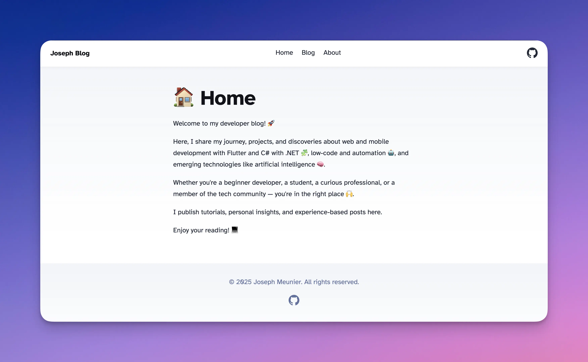

# Joseph Blog

Ce blog est un espace personnel où je partage mon parcours, mes projets et mes découvertes en tant que développeur junior. Il est construit avec [Astro](https://astro.build) et déployé sur GitHub Pages.



## 🧩 Technologies Utilisées

- **Astro** : Framework de générateur de site statique
- **MDX** : Pour écrire des articles enrichis (ex : intégration de composants ou balises HTML)
- **GitHub Actions** : CI/CD (construction, test et déploiement automatiques vers GitHub Pages)
- **WebP** : Format d'image optimisé pour le web
- **Lucide** : Pour les icônes

## 📂 Structure du Projet

Voici un aperçu de l'organisation des dossiers et fichiers :

```text
├── public/           # Ressources statiques (images, favicon, etc.)
│ └── joseph-blog/    # (Préfixe utilisé pour le déploiement GitHub Pages)
├── src/
│ ├── components/     # Composants Astro (ex : Header, Footer, BaseHead, etc.)
│ ├── content/        # Collections de contenu (articles Markdown ou MDX)
│ │ └── blog/         # Articles de blog
│ ├── layouts/        # Mises en page (ex : BlogPost.astro)
│ └── pages/          # Pages (index, à propos, etc.)
├── astro.config.mjs  # Configuration Astro (site, base, intégrations, etc.)
├── README.md         # Ce fichier
├── package.json      # Dépendances et scripts (npm, yarn, pnpm, etc.)
└── tsconfig.json     # Configuration TypeScript (strict, types, etc.)
```

Astro génère automatiquement les routes à partir des fichiers (`.astro` ou `.md`) dans le répertoire `src/pages/`.  
Le répertoire `src/content/` contient vos articles (ex : sous `blog/`), et vous pouvez utiliser la fonction `getCollection(...)` (avec un schéma de validation optionnel) pour les récupérer.  
Pour plus de détails, consultez la [documentation officielle des Collections de Contenu Astro](https://docs.astro.build/en/guides/content-collections/).

## 🧞 Commands

Exécutez les commandes suivantes depuis la racine du projet (dans un terminal) :

| Commande (npm) (ou yarn, pnpm) | Action (ou équivalent) |
|:-------------------------------|:----------------------|
| `npm install` (ou `yarn`, `pnpm i`) | Installer les dépendances (node_modules) |
| `npm run dev` (ou `yarn dev`, `pnpm dev`) | Démarrer le serveur de développement (localhost:4321) |
| `npm run build` (ou `yarn build`, `pnpm build`) | Construire le site de production vers `./dist` |
| `npm run preview` (ou `yarn preview`, `pnpm preview`) | Prévisualiser la construction localement avant le déploiement |
| `npm run astro …` (ou `yarn astro …`, `pnpm astro …`) | Exécuter les commandes CLI (ex : `astro add`, `astro check`) |
| `npm run astro – –help` (ou `yarn astro – –help`, `pnpm astro – –help`) | Afficher l'aide CLI Astro |

## Credit

Ce thème est inspiré du magnifique [Bear Blog](https://github.com/HermanMartinus/bearblog/) (par Herman Martinus) et a été adapté pour mon usage personnel.
